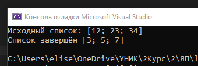

# Мартелов Елисей Группа ИТС1 Лабораторная №2

## Задание 1

### Задача 1

### Текст задачи

#### Получить список из сумм цифр натуральных чисел, содержащихся в исходном
списке

### Алгоритм решения

###### 

#### Из существующего списка "numbers" берётся каждое значение в функции "SumSpis" с помощью List.map(применяет другую функцию к каждому элементу списка), в функции "SumChislo" с помощью рекурсии запоминаюца элементы "tek" - текущий, который делится на 10 и "itoh" - сумма от остатка деления на 10

### Тестирование

##### 

### Задача 2

### Текст задачи

#### Найти сумму тех элементов списка, которые начинаются на заданную цифру

### Алгоритм решения

#### В функции numberss - происходит создание списка. В функции search - происходит получение первой цифры числа. В функции sum - просиходит сложение(x - число, а - сумма). В main происходит запрос первой цифры для поиска и вывод списка и суммы чисел

### Тестирование

